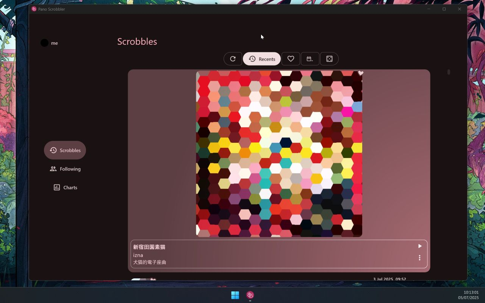
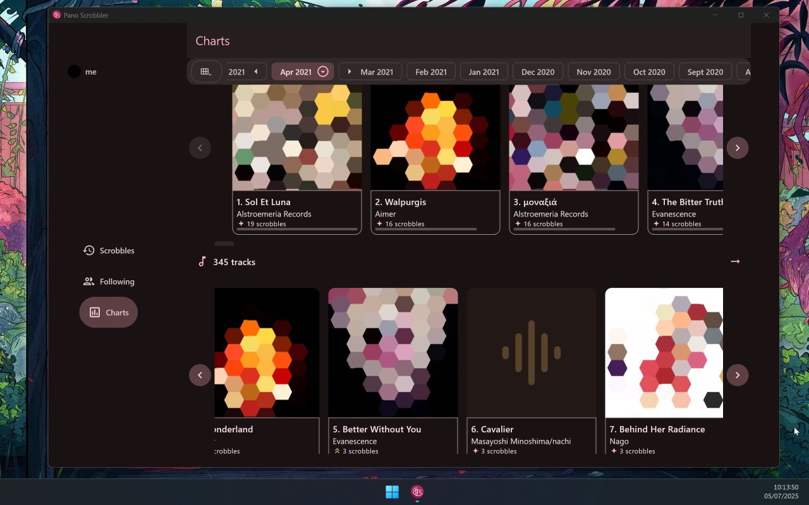
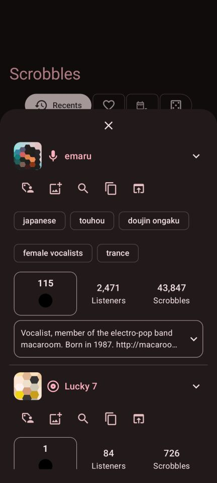

##  Pano Scrobbler

[play-store]: img/play-store.svg
[play-store-link]: https://play.google.com/store/apps/details?id=com.arn.scrobble
[github]: img/github.svg
[github-link]: https://github.com/kawaiiDango/pano-scrobbler/releases
[obtainium]: img/obtainium.svg
[obtainium-link]: https://apps.obtainium.imranr.dev/redirect?r=obtainium://add/https://github.com/kawaiiDango/pano-scrobbler
[fdroid]: img/fdroid.svg
[fdroid-link]: https://kawaiidango.github.io/pano-scrobbler/fdroid/repo?fingerprint=9954ECAB27F9FCE8290AC75A33F3DFE9FE5F6F5B8E6F33AD7F98307AC4D487BA
[ko-fi]: img/ko-fi.svg
[ko-fi-link]: https://ko-fi.com/kawaiiDango
[crowdin]: img/crowdin.svg
[crowdin-link]: https://crowdin.com/project/pscrobbler

 

 

### Downloads

**Windows:**

[![github][github]][github-link]

**Linux:**

[![github][github]][github-link]

**Android (phones, tablets, TVs and Chromebooks):**

[![github][github]][github-link] [![fdroid][fdroid]][fdroid-link] [![obtainium][obtainium]][obtainium-link] [![play-store][play-store]][play-store-link]

Since v4.0, the non-Play builds do not use Firebase Crashlytics, Google Play Services, or any closed source libraries.

The non-Play variant can optionally display a persistent notification on Android 14+.
This may help prevent the system from killing the app in the background on devices from certain manufacturers.

### Translate

[![translate][crowdin]][crowdin-link]

## [FAQ](faq.md) • [Privacy](privacy-policy.md) • [Compiling](instructions.md) • [TV](tv.md)

### Features:

- Supports Android, Android TV, Windows and Linux
- No ads ever
- Scrobbles to Lastfm, Librefm, ListenBrainz, Pleroma and other compatible services
- Scrobble to a CSV or JSONL file locally (not available on TV)
- Interactive notification- view song info, edit, love, cancel, or block songs directly from the
  notification (not available on TV)
- View song, album, artist, album artist, and tag details
- View scrobbles from a specific time, such as last year or last month
- Edit or delete existing scrobbles. Remembers edits (not available on TV)
- Extract or Fix metadata such as "Remastered" with regex pattern edits
- Block artists, songs, etc., and automatically skip or mute when they play
- Check what your followed users are listening to and view their stats
- Scrobble from the S app and Pixel Now Playing (Android only, not available on TV)
- Import and export settings, edits, and blocklists
- View charts with change indicators for specific time periods,
- Charts are also available as a customizable home-screen widget (Android only, not available on TV)
- Collage generator (not available on TV)
- View scrobble count graphs and tag clouds
- Get a random song, album, or artist from your listening history
- Search Lastfm for a songs, artists, or albums
- Fetch albums and album artists from Lastfm, if missing, before scrobbling
- Get your top scrobbles digests as a notification at the end of every week, month and year (Android only, not available on TV)
- Add or remove personal tags from the info screen (not available on TV)
- Themes
- Control Pano Scrobbler from automation apps like Tasker or MacroDroid on Android phones or command-line on desktop
- Remember and see apps you scrobbled from and play directly in them

### Credits

- Inspiration from Musixmatch's FloatingLyrics
- YouTube title parser from [Web Scrobbler](https://github.com/web-scrobbler/web-scrobbler) and [Metadata Filter](https://github.com/web-scrobbler/metadata-filter)
- Icons from [pictogrammers.com](https://pictogrammers.com) and [material.io](https://material.io)
- Genres filter from [everynoise.com](https://everynoise.com)

Thanks to the amazing [translators](composeApp/src/commonMain/composeResources/files/crowdin_members.txt) and everyone who
reported bugs and helped me with this project.

### Disclaimer

This project is not affiliated with Last.fm, or any other scrobbling service.

### License

Pano Scrobbler is licensed under the [GNU General Public License v3](http://www.gnu.org/copyleft/gpl.html).
