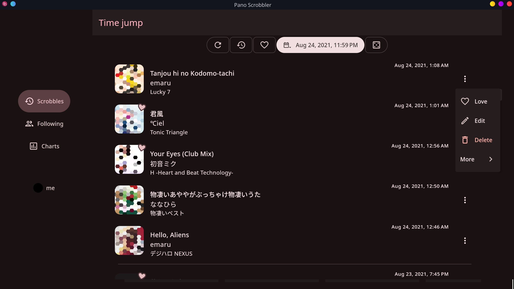
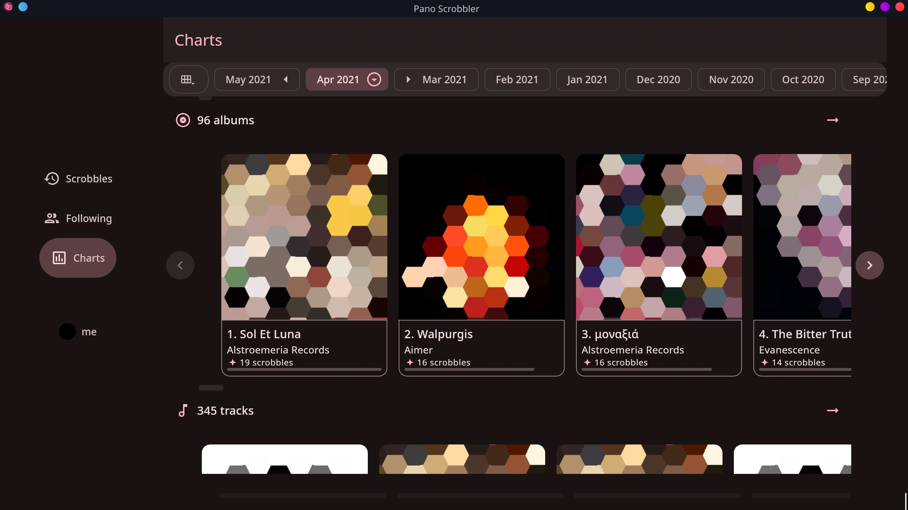
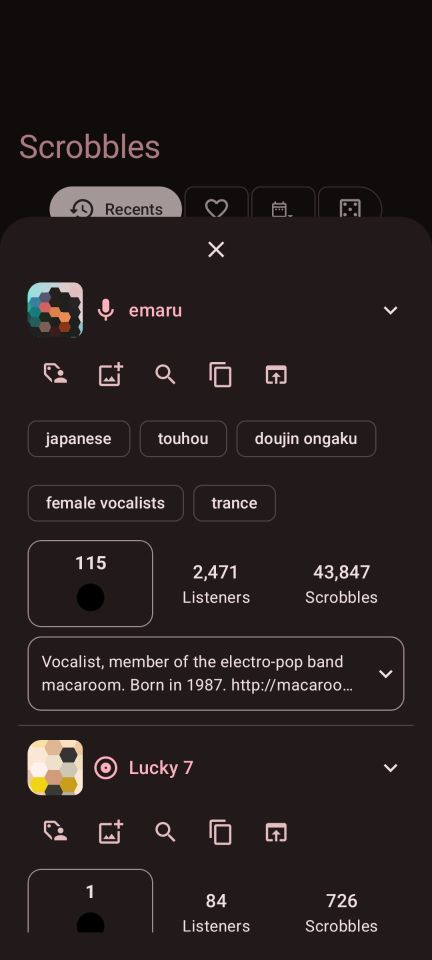

#  Pano Scrobbler

[\[repository\]](https://github.com/kawaiiDango/pano-scrobbler)

[](desktop-screenshots/1-scrobbles-desktop.jpg)
[](desktop-screenshots/2-charts-desktop.jpg)
[](fastlane/metadata/android/en-US/images/phoneScreenshots/3-friends-mobile.jpg)
[](fastlane/metadata/android/en-US/images/phoneScreenshots/4-details-mobile.jpg)

## Downloads

### Windows:

[](https://github.com/kawaiiDango/pano-scrobbler/releases/latest/download/pano-scrobbler-windows-x64.exe)
[](https://winstall.app/apps/kawaiiDango.pano-scrobbler)

#### WinGet:

```
winget install -e --id kawaiiDango.pano-scrobbler
```

Windows releases are unsigned, so a SmartScreen warning about "Unknown Publisher" is normal.

The installer also has an "extract only, no install" mode for portable use.

### Linux:

[](https://aur.archlinux.org/packages/pano-scrobbler-bin)
[](https://kawaiidango.netlify.app/apt)
[](https://copr.fedorainfracloud.org/coprs/kawaiidango/pano-scrobbler/)
[](https://github.com/kawaiiDango/pano-scrobbler-flake)
[](https://github.com/kawaiiDango/pano-scrobbler/releases/latest/download/pano-scrobbler-linux-x64.AppImage)
[](https://github.com/kawaiiDango/pano-scrobbler/releases/latest/download/pano-scrobbler-linux-arm64.AppImage)

[](https://github.com/kawaiiDango/pano-scrobbler/releases/latest/download/pano-scrobbler-linux-x64.tar.gz)
[](https://github.com/kawaiiDango/pano-scrobbler/releases/latest/download/pano-scrobbler-linux-arm64.tar.gz)

#### Arch:

```sh
yay -S pano-scrobbler-bin
```

#### Debian/Ubuntu:

```sh
curl -sL "https://keyserver.ubuntu.com/pks/lookup?op=get&search=0x5CB896FA8DAF303AEB5FCE4DDB06725ACB6921A0" \
  | gpg --dearmor \
  | sudo tee /etc/apt/keyrings/kawaiiDango.gpg > /dev/null
echo "deb [signed-by=/etc/apt/keyrings/kawaiiDango.gpg] https://kawaiidango.netlify.app/apt/pano-scrobbler all main" | sudo tee /etc/apt/sources.list.d/pano-scrobbler.list
sudo apt update
sudo apt install pano-scrobbler
```

#### Fedora (COPR):

```sh
sudo dnf copr enable kawaiidango/pano-scrobbler
sudo dnf install pano-scrobbler
```

#### Nix flake:

Full instructions
at [kawaiiDango/pano-scrobbler-flake](https://github.com/kawaiiDango/pano-scrobbler-flake)

```
github:kawaiiDango/pano-scrobbler-flake
```

#### AppImage:

The AppImage runs anywhere, requires no installation, has **automatic updates** and can optionally
add itself to the **application launcher** for convenience. Just make it executable before running:

```sh
chmod +x pano-scrobbler-linux-*.AppImage
```

The desktop versions do not use any closed source libraries.

### Android (phones, tablets, TVs and Chromebooks):

[](https://github.com/kawaiiDango/pano-scrobbler/releases)
[](https://apps.obtainium.imranr.dev/redirect?r=obtainium://add/https://github.com/kawaiiDango/pano-scrobbler)
[](https://apt.izzysoft.de/fdroid/index/apk/com.arn.scrobble)
[](https://kawaiidango.github.io/pano-scrobbler/fdroid/repo?fingerprint=9954ECAB27F9FCE8290AC75A33F3DFE9FE5F6F5B8E6F33AD7F98307AC4D487BA)
[](https://play.google.com/store/apps/details?id=com.arn.scrobble)

Since v4.0, the non-Play builds do not use Firebase Crashlytics, Google Play Services, or any closed
source libraries.

Installing the non-Play version from the F-Droid compatible repo, IzzyOnDroid or Obtainium will get
you **automatic updates**.

#### APK SHA256 fingerprint for non-Play builds:

```
9E:68:AB:6B:D6:11:CE:79:DD:5D:53:E3:5A:15:CF:93:CF:73:9A:4E:94:C4:9A:B1:BF:10:DD:12:65:F0:2E:6C
```

## Translate

[](https://crowdin.com/project/pscrobbler)

## [FAQ](faq.md) • [Privacy](privacy-policy.md) • [Compiling](instructions.md)

## Features:

### For all platforms (Windows, Linux, Android, Android TV):

- No ads ever
- Scrobbles to Lastfm, Librefm, ListenBrainz, Pleroma and other compatible services
- View song, album, artist, album artist, and tag details
- View scrobbles from a specific time, such as last year or last month
- Extract or fix metadata such as "Remastered" with regex pattern edits
- Extract the first artist from a string of all performers before scrobbling
- Block artists, songs, etc., and automatically skip or mute when they play
- Check what your followed users are listening to and view their stats
- Import and export settings, edits, and blocklists
- View charts with change indicators for specific time periods
- View scrobble count graphs and tag clouds
- Get a random song, album, or artist from your listening history
- Search Lastfm for songs, artists, or albums
- Themes
- Remember and see apps you scrobbled from and play directly in them
- Supports network proxies

### For desktop and Android (except TV):

- Scrobble to a CSV or JSONL file locally
- Interactive notification - view song info, edit, love, cancel, or block songs directly from the
  notification
- Collage generator
- Add or remove personal tags from the info screen
- Edit or delete existing scrobbles. Remembers edits
- Control Pano Scrobbler from automation apps on Android or command-line on desktop

### Android only (except TV):

- Scrobble from apps that identify music playing around you: Shazam, Ambient Music Mod and Audile
- Scrobbling the new Pixel Now Playing app (since the March 2026 Pixel feature drop) is possible
  only with root and KieronQuinn's Xposed module
  [Public Compute Services](https://github.com/KieronQuinn/PublicComputeServices)
  [\[Why?\]](https://github.com/kawaiiDango/pano-scrobbler/issues/876)
- Charts as a customizable home-screen widget
- Get your top scrobbles digests as a notification at the end of every week, month and year

### Desktop only:

- Customizable Discord Rich Presence

## Credits

- YouTube title parser from [Web Scrobbler](https://github.com/web-scrobbler/web-scrobbler)
  and [Metadata Filter](https://github.com/web-scrobbler/metadata-filter)
- Icons from [pictogrammers.com](https://pictogrammers.com)
  and [Material Symbols](https://fonts.google.com/icons)
- Genres filter from [everynoise.com](https://everynoise.com)
- Tidal SteelSeries Integration from [TidalRPC](https://github.com/BitesizedLion/TidalRPC)
- Artists list from [MusicBrainz](https://musicbrainz.org)

Thanks to the
amazing [translators](composeApp/src/commonMain/composeResources/files/crowdin_members.txt) and
everyone who reported bugs and helped me with this project.

## Disclaimer

This project is not affiliated with Last.fm, Libre.fm, ListenBrainz or any other scrobbling service.

## License

SPDX-License-Identifier: GPL-3.0-or-later

Pano Scrobbler is licensed under
the [GNU General Public License v3 or later](http://www.gnu.org/copyleft/gpl.html).
